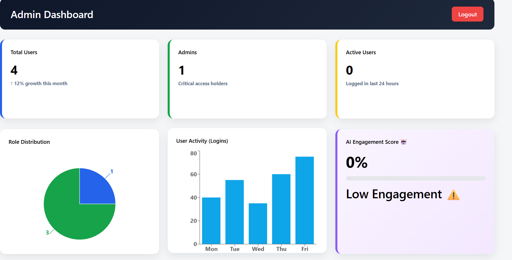
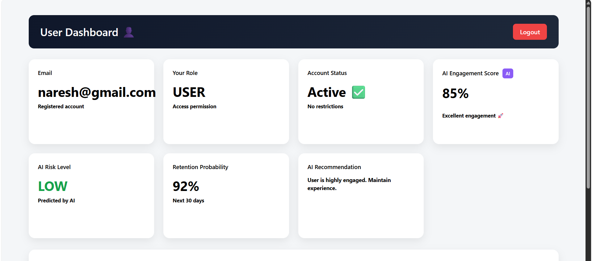

🚀 #Enterprise AI User Management & Analytics Platform

A full-stack Enterprise-grade User Management System with AI-powered analytics, role-based access control, and predictive engagement insights.
Built with Spring Boot, React, MongoDB, JWT Security, and AI/ML analytics.

🧠 Project Overview
This project is designed to simulate a real-world enterprise SaaS platform where:
- Admins manage users & monitor system health
- Users view personalized dashboards
- AI predicts engagement, retention, and risk
- Role-based security controls access

Data is visualized with interactive charts

This makes the project unique, scalable, and interview-ready.

✨ Key Features
🔐 Authentication & Security

JWT-based authentication
- Role-based access (ADMIN / USER)

- Spring Security filter chain

- Secure API access control

🧑‍💼 #Admin Dashboard

Admins can:

- View total users, admins, active users

- See role distribution (Pie Chart)

- Monitor login activity (Bar Chart)

Promote / Demote users

- Delete users

- View individual user details

- View AI Engagement Score

- Monitor platform health

👤 #User Dashboard

Users can:

- View profile info (email, role, status)

- See AI Engagement Score

- View AI Risk Level (LOW / MEDIUM / HIGH)

- See Retention Probability

- Get AI Recommendations

- Track performance overview

🤖 #AI & Predictive Analytics

AI logic provides:

- Engagement Score prediction

- User Risk Level prediction

- Retention Probability (churn risk)

- AI-generated recommendations

These are calculated on the backend and displayed in real-time on the frontend.

🛠 #Tech Stack
Backend

- Java 17

- Spring Boot 3

- Spring Security

- JWT Authentication

- MongoDB
Smile ML Library (AI/Analytics)
-REST APIs

#Frontend
React + Vite
-Axios
-Recharts (Charts)
-Context API (Auth)
-Modern responsive UI
-CSS Grid & Flexbox

📊 #Dashboards Preview
- Admin Dashboard
- User statistics cards
- Role distribution pie chart
- User activity bar chart
- AI Engagement insights
- User management table
- User Dashboard
- Profile summary cards
- AI Engagement Score
- AI Risk Level

Retention Probability

AI Recommendations

Performance charts

🧩 Architecture
React Frontend
     |
     |  JWT
     v
Spring Boot Backend
     |
     | MongoDB
     v
User & Activity Data
     |
     | AI Analytics Service
     v
Predictions & Insights

🔄 API Highlights
Auth

POST /api/auth/register

POST /api/auth/login

Admin

GET /api/admin/users

PUT /api/admin/users/{id}/promote

DELETE /api/admin/users/{id}

GET /api/admin/analytics

User AI

GET /api/user/risk-analysis

GET /api/user/analytics

🎯 Why This Project is Unique

✅ Combines Enterprise User Management + AI Analytics
✅ Real JWT security (not mock auth)
✅ Predictive AI features (risk + retention)
✅ Clean dashboards for Admin & User
✅ Production-style architecture
✅ Great for interviews, hackathons & portfolio

🚀 Future Enhancements

Real-time WebSocket updates

Email alerts for high-risk users

Admin AI recommendations

User activity heatmaps

Audit logs & compliance tracking

AI model training with real datasets

📸 Screenshots

Add your dashboard screenshots here in GitHub:

🧑‍💻 Author
Naresh Kumar S
Full Stack Developer | Java | React | AI-Driven Applications
